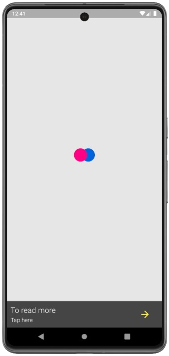
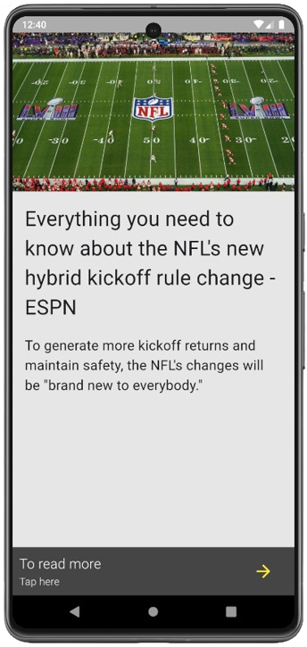

#  QuickNews

The QuickNews App is a Flutter application that provides users with short news articles. It fetches news data from an API and displays them in a user-friendly interface. This README provides an overview of the app, its features, and instructions for installation and usage.

## Features

- Short News Articles: Get quick access to short news articles.
- Image Loading: Images associated with news articles are loaded asynchronously from the API.
- Read More: Users can tap on a news article to read more about it in their web browser.
- Instagram-like Scroll: Scroll horizontally to view different news articles, and vertically to read more content within each article.

## Screenshots




## Installation

### 1. Clone this repository to your local machine:

```git clone https://github.com/your-username/news-app.git```

### 2. Navigate to the project directory:

```cd news-app```

### 3. Install dependencies:

```flutter pub get```

### 4. Run the app:

```flutter run```

## Usage
Upon launching the app, short news articles will be displayed.
Scroll vertically to view different news articles.
Tap on a news article to read more about it in your web browser.

## Contributing
Contributions are welcome! Feel free to open issues or submit pull requests to contribute to this project. For major changes, please open an issue first to discuss what you would like to change.
